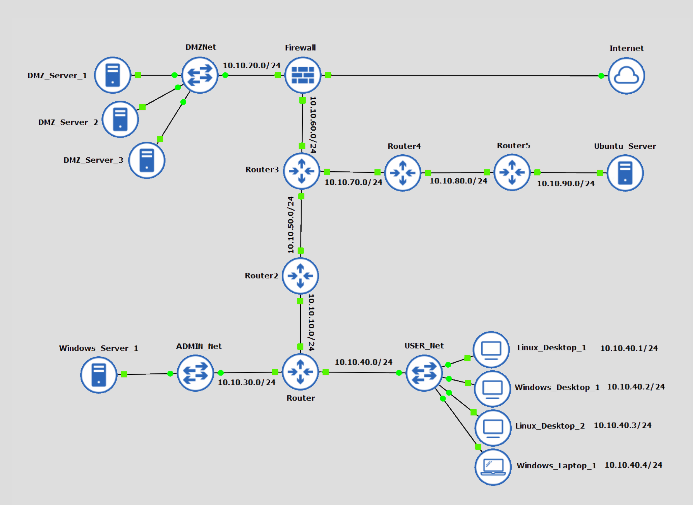

# network-troubleshooting

- Ticket #1
  - Scenario: There are multiple reports of employees located in the USERNet subnet who cannot get to `www.domain.edu`, and they are being redirected to a suspicious site. A help desk technician states that the server team recently installed updates to DMZ_Server_3 which acts as the DNS Server for the organization.
 
- Ticket #2
  - Scenario: A complaint came in that a certain organization is hosting an illegal FTP site to download copyrighted software. The security team has provided a pcap file capturing all FTP traffic on the network. They've asked you to identify where the FTP site is being hosted.
 
- Ticket #3
  - Scenario: The host "Ubuntu_Server" can’t get to any of the assigned networks or the internet, which is preventing the server from pulling the required security patches.
 
- Ticket #4
  - Scenario: A user complains that he cannot access the internet or network resources on his company laptop (Windows_Laptop_1) when it is connected via an ethernet cable to the office network.
 
- Ticket #5
  - Scenario: A coworker states that she worked on a ticket to allow access through the firewall to DMZ_Server_1. There is now no access to the server from any device outside its network.
 
- Ticket #6
  - Scenario: Your local cyber security team is requesting to know what ports are open on DMZ_Server2 to identify services that may be running outside of the permitted services. Permitted services are 22/ssh, 135/msrpc, 3389/ms-wbt-server, and 8080/http-proxy.
       
 

  

Review each of the six helpdesk ticket scenarios, then using the Infosec virtual machine (link in the Web Links section), do the following for each ticket:
  - 1.  Provide a clear screenshot(s) with a full view of the screen, including the date and time that shows the problem has been identified and resolved.
  - 2.  Provide a root cause analysis write-up by doing the following: 
    - a.  Identify the tool that you used and explain why you chose it to troubleshoot the problem.
    - b.  Describe your solution to the problem including details of the troubleshooting steps that took place.      
 

See the [performance assessment here.](assessment.md)
